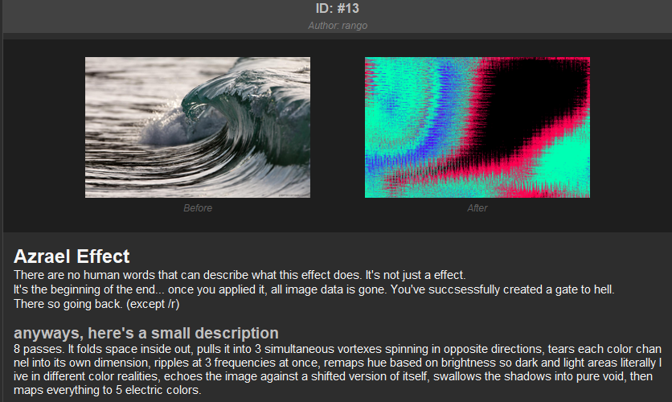

# Important Notice
By creating a PhotoPhile account you automatically agree to our community guidelines. Any posts that are disturbing, harmful, or offensive will be removed without warning and the responsible account will be permanently banned from the platform. In severe cases, user information will be reported to the relevant authorities.

# Welcome to PhotoPhile!
PhotoPhile is a fun little image editor where you can load any photo and apply a variety of creative effects to it. Share your creations on the community board or export them straight to your PC. It's up to you.
This app is still a work in progress, so if you run into anything weird or have ideas for new features, please leave feedback or open an issue. Every bit of input helps make PhotoPhile better.
PhotoPhile runs on Supabase for its backend. If you'd like to support the project and help cover server costs, feel free to donate via the link below — though there's absolutely no pressure to do so. [Donate]()
PhotoPhile is completely free to use. No hidden fees, no data collection, no funny business. Just you and your images.

## Current Version: 1.2
### Features:
- Import/Export images
- Save edited images to personal workspace
- Apply effects 

- Create an account or login
- Visit the community tab and post your work

- Comment/Like/Vote inside of posts
- Create a gate to hell

- Customize your profile picture as well as your biography :D
- More to come!

